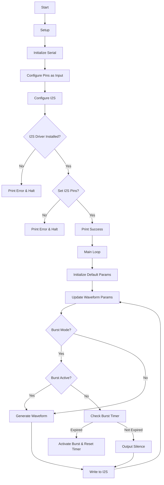

# ESP32 Waveform Generator

## Table of Contents
1. [Introduction](#introduction)
2. [Features](#features)
3. [Hardware Requirements](#hardware-requirements)
4. [Pin Configuration](#pin-configuration)
5. [Software Dependencies](#software-dependencies)
6. [Installation](#installation)
7. [Usage](#usage)
8. [Waveform Types](#waveform-types)
9. [Control Modes](#control-modes)
10. [Function Descriptions](#function-descriptions)
11. [Flowchart](#flowchart)
12. [Customization](#customization)
13. [Troubleshooting](#troubleshooting)
14. [Contributing](#contributing)

## Introduction

This project implements a versatile waveform generator using an ESP32 microcontroller. It generates various types of waveforms with adjustable parameters such as frequency, amplitude, and phase. Additionally, it features sweep and burst modes for more complex signal generation.

## Features

- Generate five types of waveforms: Sine, Square, Sawtooth, Triangle, and Pulse
- Adjustable frequency (1-1000 Hz)
- Adjustable amplitude
- Adjustable phase
- Stereo/Mono output mode
- Frequency sweep mode
- Burst mode
- Real-time parameter control via potentiometers and buttons
- I2S output for high-quality audio generation

## Hardware Requirements

- ESP32 development board
- 5 x 10k potentiometers
- 4 x push buttons
- I2S DAC (e.g., UDA1334A, PCM5102, or similar)
- Breadboard and jumper wires

## Pin Configuration

| Component | ESP32 Pin |
|-----------|-----------|
| Waveform Select Button | GPIO 2 |
| Stereo/Mono Mode Button | GPIO 4 |
| Sweep Mode Button | GPIO 5 |
| Burst Mode Button | GPIO 15 |
| Frequency Potentiometer | GPIO 34 (ADC1_CH6) |
| Amplitude Potentiometer | GPIO 35 (ADC1_CH7) |
| Phase Potentiometer | GPIO 32 (ADC1_CH4) |
| Sweep Rate Potentiometer | GPIO 33 (ADC1_CH5) |
| Burst Duration Potentiometer | GPIO 36 (ADC1_CH0) |
| I2S BCLK | GPIO 26 |
| I2S WCLK | GPIO 25 |
| I2S DOUT | GPIO 22 |

## Software Dependencies

- Arduino IDE
- ESP32 board support package
- ESP32 I2S library

## Installation

1. Install the Arduino IDE from the [official website](https://www.arduino.cc/en/software).
2. Add ESP32 board support to Arduino IDE:
   - Go to File > Preferences
   - Add the following URL to the "Additional Boards Manager URLs" field:
     `https://raw.githubusercontent.com/espressif/arduino-esp32/gh-pages/package_esp32_index.json`
   - Go to Tools > Board > Boards Manager
   - Search for "esp32" and install the "ESP32 by Espressif Systems" package
3. Clone or download this repository to your local machine.
4. Open the `waveform_generator.ino` file in Arduino IDE.
5. Select your ESP32 board from Tools > Board menu.
6. Select the correct port from Tools > Port menu.
7. Click the Upload button to compile and upload the code to your ESP32.

## Usage

1. Connect the potentiometers, buttons, and I2S DAC to the ESP32 according to the pin configuration.
2. Power up the ESP32 and I2S DAC.
3. Use the buttons to select the desired waveform and modes:
   - Waveform Select Button: Cycle through available waveform types
   - Stereo/Mono Mode Button: Toggle between stereo and mono output
   - Sweep Mode Button: Toggle frequency sweep mode on/off
   - Burst Mode Button: Toggle burst mode on/off
4. Adjust the potentiometers to control various parameters:
   - Frequency Potentiometer: Set the base frequency (1-1000 Hz)
   - Amplitude Potentiometer: Set the waveform amplitude
   - Phase Potentiometer: Adjust the phase of the waveform
   - Sweep Rate Potentiometer: Control the speed of frequency sweeping (when sweep mode is enabled)
   - Burst Duration Potentiometer: Set the duration between bursts (when burst mode is enabled)
5. The generated waveform will be output through the I2S DAC.

## Waveform Types

1. Sine Wave: A smooth, periodic oscillation
2. Square Wave: A signal that alternates between two fixed voltage levels
3. Sawtooth Wave: A wave that ramps upward and then sharply drops
4. Triangle Wave: A wave that ramps up and down symmetrically
5. Pulse Wave: Similar to a square wave, but with an adjustable duty cycle (currently set to 10%)

## Control Modes

### Sweep Mode
When enabled, the frequency of the waveform will periodically sweep up and down around the base frequency set by the frequency potentiometer. The sweep rate is controlled by the sweep rate potentiometer.

### Burst Mode
When enabled, the waveform will be generated in short bursts. The duration between bursts is controlled by the burst duration potentiometer.

## Function Descriptions

### `setup()`
Initializes serial communication, configures input pins, and sets up the I2S driver.

### `loop()`
The main program loop that continuously updates waveform parameters and generates the waveform.

### `updateWaveformParams(WaveformParams* params)`
Reads the state of buttons and potentiometers to update the waveform parameters.

### `generateWaveform(const WaveformParams& params)`
Generates the waveform based on the current parameters and outputs it via I2S.

## Flowchart 

## Customization

You can customize the waveform generator by modifying the following aspects of the code:

- Adjust the frequency range by changing the mapping in `updateWaveformParams()`.
- Modify the sweep range by adjusting the calculation in `generateWaveform()`.
- Change the burst duration or pattern in the `loop()` function.
- Add new waveform types by extending the switch statement in `generateWaveform()`.

## Troubleshooting

- If you don't hear any output, check the I2S DAC connections and ensure the amplitude is set high enough.
- If the waveform sounds distorted, try reducing the amplitude or adjusting the I2S configuration.
- If buttons or potentiometers don't seem to work, double-check the pin connections and ensure they are properly pulled up/down.

## Contributing

Contributions to this project are welcome. Please fork the repository and submit a pull request with your improvements.